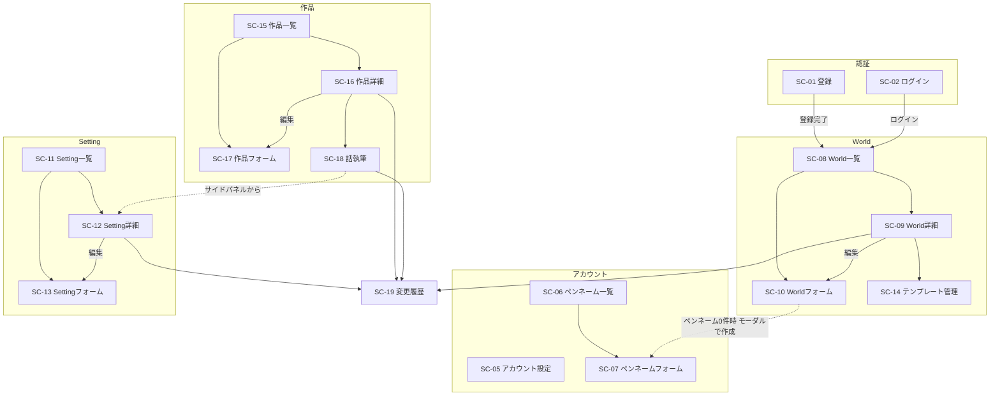

# 画面遷移図・共通方針

**作成日**: 2026-09-03
**ステータス**: ドラフト
**根拠**: [画面一覧.md](画面一覧.md)（画面17＋ダイアログ6、Phase 1確定）

---

## 共通方針

### レイアウトの基本構成

- **PC利用を前提**とする（執筆ツールとしての利用が中心のため）。スマホ対応はレイアウト崩れがない程度に留め、専用UIは作らない
- 全画面共通で**上部固定ヘッダー**にグローバルナビゲーションを置く

```
┌────────────────────────────────────────────┐
│ [ロゴ]  World一覧  設定一覧  作品一覧  │ [ペンネーム] [アカウント▼] │ ← ヘッダー（固定）
├────────────────────────────────────────────┤
│                                            │
│              各画面のコンテンツ              │
│                                            │
└────────────────────────────────────────────┘
```

- 「アカウント▼」はドロップダウン: アカウント設定（SC-05）／ログアウト
- 未ログイン時はヘッダーに「ログイン」「登録」のみ表示

### URL設計（React Router）

| URL | 画面 |
|---|---|
| `/register` | SC-01 ユーザー登録 |
| `/login` | SC-02 ログイン |
| `/account` | SC-05 アカウント設定 |
| `/pennames` | SC-06 ペンネーム一覧 |
| `/pennames/new`・`/pennames/:id/edit` | SC-07 ペンネーム作成・編集 |
| `/worlds` | SC-08 World一覧 |
| `/worlds/new`・`/worlds/:id/edit` | SC-10 World作成・編集 |
| `/worlds/:id` | SC-09 World詳細 |
| `/worlds/:id/templates` | SC-14 テンプレート管理 |
| `/settings` | SC-11 Setting一覧 |
| `/settings/new`・`/settings/:id/edit` | SC-13 Setting作成・編集 |
| `/settings/:id` | SC-12 Setting詳細 |
| `/novels` | SC-15 作品一覧 |
| `/novels/new`・`/novels/:id/edit` | SC-17 作品作成・編集 |
| `/novels/:id` | SC-16 作品詳細 |
| `/episodes/:id` | SC-18 話（Episode）執筆 |
| `/changelog/:targetType/:targetId` | SC-19 変更履歴（例: `/changelog/setting/42`） |

- アカウント設定は `/account`、Setting一覧は `/settings` として名前の衝突を回避する
- 未ログインで `/register`・`/login` 以外にアクセスした場合は `/login` へリダイレクト

### 共通UIパターン

**「削除済みを表示」トグル**（SC-08・SC-11・SC-15・SC-16内で共通）
- 一覧の右上にトグルスイッチを配置。デフォルトOFF（有効なもののみ表示）
- ON時: 削除済みの行をグレーアウト＋「削除済み」バッジ付きで混在表示し、各行に「復元」ボタンを出す
- 復元は確認ダイアログなしで即実行（失敗しても削除済みに戻るだけで破壊的でないため）

**削除確認ダイアログ**（DL-01〜03・05・06で共通）
- モーダル形式。「（対象名）を削除しますか？」＋補足1行＋「キャンセル／削除する」
- 配下件数の表示はしない（World.mdの決定に従う）。ただしアカウント削除（DL-06）のみ連鎖削除される旨の補足を入れる

**変更履歴ボタン**
- 各詳細画面（SC-09・SC-12・SC-16・SC-18）のタイトル行右側に「変更履歴」ボタンを配置し、SC-19へ遷移する

**フォームのバリデーション表示**
- 入力欄の直下にインラインでエラーメッセージを表示。サブミット時にまとめて検証する
- 文字数上限のある欄（説明1024文字など）は残り文字数カウンタを表示

**画像アップロード**（icon・cover_image共通）
- ファイル選択＋プレビュー表示のみのシンプルな構成。トリミング機能は付けない（設計時の判断、要レビュー）

---

## 画面遷移図



- ログイン・登録完了後の遷移先は**World一覧（SC-08）**とする（Worldがすべての起点のため）
- グローバルナビからはSC-08・SC-11・SC-15・SC-06・SC-05へいつでも遷移できる（図では省略）

---

## 個別画面の仕様書

`画面仕様書/` 配下に**1画面につき1ファイル**、ドメインごとのフォルダで管理する（2026-09-03再構成）。一覧は [画面仕様書/README.md](画面仕様書/README.md) を参照。

```
docs/design/
├── 画面一覧.md              … 画面の全体像・ID採番
├── 画面遷移-共通方針.md      … 本ファイル
└── 画面仕様書/
    ├── README.md            … 仕様書インデックス
    ├── 認証アカウント/       … SC-01・02・05・06・07
    ├── World/               … SC-08・09・10
    ├── Setting/             … SC-11・12・13・14
    ├── 作品執筆/             … SC-15・16・17・18
    └── 変更履歴/             … SC-19
```
